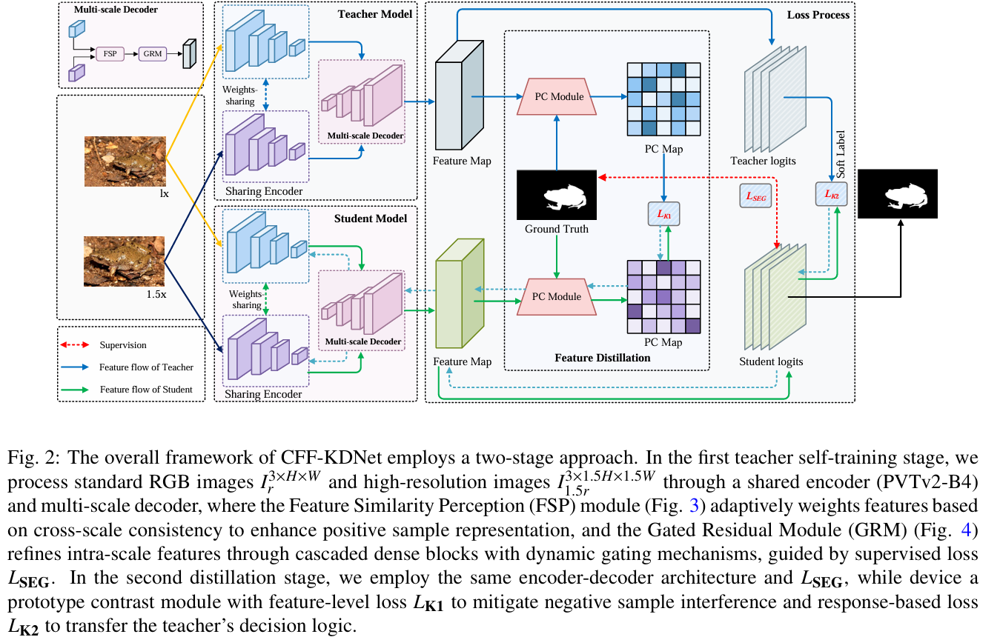

# CFF-KDNet: Cross-Scale Feature Fusion Network with Knowledge Distillation for Camouflaged Object Detection
Authors: Bo Cai, Houjie Li, Yanping Yang, Jin Yan

Our work has been accepted by ESWA. The code has already been open sourced.

If you are interested in our work, please do not hesitate to contact us at 765499227@qq.com via email.


<!-- ## This paper is reviewed at ESWA  -->

## 🔆 News


[17.9.2025] We have released the code and model checkpoints for CFF-KDNet !
[27.10.2025] CFF-KDNet has beenaccepted by ESWA !

## 🕳 Performance

<!-- | Model | Backbone | CAMO (S_α/Fβω/MAE/Eξ) | COD10K (Sm/Fβω/MAE/Eξ) | NC4K (Sm/Fβω/MAE/Eξ) |
|-------|----------|----------------------|------------------------|---------------------|
| CFF-KDNet-E2 | EfficientNet-B2 | 0.855/0.812/0.052/0.912 | 0.866/0.779/0.023/0.922 | 0.878/0.827/0.034/0.925 |
| CFF-KDNet-R2 | Res2Net-50 | 0.832/0.786/0.062/0.886 | 0.866/0.789/0.023/0.922 | 0.871/0.824/0.036/0.920 |
| CFF-KDNet-P2 | PVTv2-B2 | 0.870/0.833/0.048/0.920 | 0.889/0.821/0.019/0.937 | 0.897/0.854/0.030/0.936 |
| CFF-KDNet-S| SMT-T | 0.880/0.847/0.045/0.929 | 0.891/0.822/0.019/0.940 | 0.899/0.861/0.029/0.940 |
| CFF-KDNet-P4 | PVTv2-B4 | 0.888/0.859/0.040/0.940 |0.900/0.842/0.017/0.949 | 0.902/0.867/0.027/0.943 | -->

| Model | Backbone | Params | CAMO (S_α/Fβω/MAE/Eξ) | COD10K (S_α/Fβω/MAE/Eξ) | NC4K (S_α/Fβω/MAE/Eξ) |
|-------|----------|--------|---------------------|------------------------|----------------------|
| CFF-KDNet-E2 | EfficientNet-B2 | 13.06M | 0.855/0.812/0.052/0.912 | 0.866/0.779/0.023/0.922 | 0.878/0.827/0.034/0.925 |
| CFF-KDNet-R2 | Res2Net-50 | 36.06M | 0.832/0.786/0.062/0.886 | 0.866/0.789/0.023/0.922 | 0.871/0.824/0.036/0.920 |
| CFF-KDNet-P2 | PVTv2-B2 | 35.62M | 0.870/0.833/0.048/0.920 | 0.889/0.821/0.019/0.937 | 0.897/0.854/0.030/0.936 |
| CFF-KDNet-S | SMT-T | 21.73M | 0.880/0.847/0.045/0.929 | 0.891/0.822/0.019/0.940 | 0.899/0.861/0.029/0.940 |
| CFF-KDNet-P4 | PVTv2-B4 | 72.81M | 0.888/0.859/0.040/0.940 | 0.900/0.842/0.017/0.949 | 0.902/0.867/0.027/0.943 |


## 🔧 Setup
<!-- ###### This is a Heading h6 -->

<!-- ## Runtime -->

<!-- *This text will be italic*  
_This will also be italic_

This text will be bold  
__This will also be bold__

_You can combine them_ -->
## 📖 Prepare Data
COD dataset can be found at [google drive](https://drive.google.com/file/d/1HPTKBZUgxj5E8SBcSTTIHDxpZJiavg4I/view?usp=drive_link).


## ⛓ Install Requirements

* Python 3.10.16
* torchvision 0.16.2
* Others: pip install -r requirements.txt
## 🧪 Evaluation
```
Tercher:
python train.py --config configs/icod_train.py --model-name <MODEL_NAME> --evaluate --load-from <TRAINED_WEIGHT>

Student:
python train_kd.py --config configs/icod_train.py --model-name <MODEL_NAME> --evaluate --load-from <TRAINED_WEIGHT>
```

## 🪢 Training
###  First training teacher model
```
python train.py --config configs/icod_train.py --pretrained --model-name CFFKDNet_PVTB4
```
### Then training student model
```
python train_kd.py --config configs/icod_train.py --pretrained --model-name Res2Net50_KD
```

## 🖼 Prediction maps
We provide the prediction maps of our CFF-KDNet model COD Dataset [here](https://drive.google.com/drive/folders/1-UCFicbqtu5moIzUx3gMCyX_WOsk0vaz?usp=drive_link), including:
 PVT,Res2Net,EfficientNet and SMT.

<!-- ## ⚡ Training weights
We give the pred training weights of our CFF-KDNet model in COD tasks.

Note that you should use the relevant network in the lib_initial file to test these .pth files -->

CFF-KDNet-weights (PVT/SMT/Res2Net) [here](https://drive.google.com/drive/folders/1U_Oi-NZ9HuMFtbsNrEH3dG_oA333IBMm?usp=drive_link).

## 🗂 Citation
If you use CFF-KDNet method in your research or wish to refer to the baseline results published in the Model, please use the following BibTeX entry.
```

```
<!-- 
## Images


## Links

You may be using [Markdown Live Preview](https://markdownlivepreview.com/).

## Blockquotes

> Markdown is a lightweight markup language with plain-text-formatting syntax, created in 2004 by John Gruber with Aaron Swartz.
>
>> Markdown is often used to format readme files, for writing messages in online discussion forums, and to create rich text using a plain text editor.

 
## Blocks of code

```
let message = 'Hello world';
alert(message);
```

## Inline code

This web site is using `markedjs/marked`. -->
